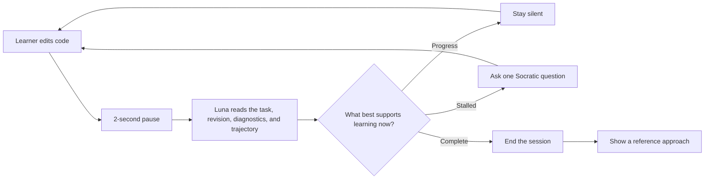

<p align="center">
  
</p>

<h1 align="center">Socratic Runtime</h1>

<p align="center"><strong>An ambient programming tutor that knows when not to answer.</strong></p>
<p align="center">OpenAI Build Week 2026 · Education</p>

Socratic Runtime is a VS Code learning companion powered by Codex CLI and GPT-5.6 Luna. It follows the learner's coding trajectory, stays quiet while their reasoning is productive, and asks one focused question when help would be useful.

It is not a chatbot. The learner keeps coding in their own file; the tutor enters the flow only when needed.

Most AI coding assistants optimize for completing the code. Socratic Runtime optimizes for the learner still doing the thinking.

**[Watch the 58-second product demo](https://www.youtube.com/watch?v=r1iTNYuWIGM)**

## The learning loop



Silence is an intentional action. Questions can recur when the learner makes progress and later encounters a new obstacle. **Ask for a Nudge** is always available.

## Built with Codex and GPT-5.6

GPT-5.6 has two distinct roles in Socratic Runtime:

- **GPT-5.6 Sol — development partner:** I created the codebase end to end through an agentic development workflow with Codex. Sol was my implementation and brainstorming partner across architecture exploration, TypeScript development and refactoring, test creation, adversarial review, UI refinement, documentation, dependency auditing, and VSIX release preparation. I remained responsible for the learning hypothesis, product direction, pedagogical boundaries, architecture decisions, and acceptance of the final behavior.
- **GPT-5.6 Luna medium — part of the product:** The installed extension invokes Luna through the authenticated Codex CLI after meaningful learner revisions. Luna reads a bounded view of the task, current and previous code, editor diagnostics, and recent trajectory, then chooses whether to `remain_silent`, `ask_question`, or `complete`. It can also propose a task when none is supplied and prepare the post-completion reference approach.

The implementation was produced through this Codex-led development workflow, while the shipped product uses Codex CLI as its reasoning bridge to Luna. The same existing ChatGPT/Codex sign-in supports the runtime, so learners do not need a separate API key or product account.

## Start learning

You need VS Code, Codex CLI, and an existing ChatGPT/Codex sign-in. Socratic Runtime uses that sign-in—there is no separate account or API key.

1. Download the VSIX from the [latest release](https://github.com/ilias-sol/socratic-runtime/releases/latest).
2. In VS Code, run **Extensions: Install from VSIX...** and reload.
3. Open a programming file and run **Socratic Runtime: Start on Current File** from `Ctrl+Shift+P`.
4. Code normally.

The task can live in an `@socratic-task` comment:

```python
"""
@socratic-task
Implement binary search over a sorted list.

Requirements:
- Return a matching index.
- Return -1 when the target is absent.
- Aim for logarithmic time.
"""
```

You can also select a task before starting. If neither is available, Luna proposes a task for confirmation.

No language-specific setup, test suite, hidden configuration, or project registration is required. The same interaction works across text-based languages that Luna can interpret; Python is the included demonstration.

## Designed for learning

- **Ambient, not conversational:** support lives beside the editor instead of becoming another chat thread.
- **Trajectory-aware:** Luna compares revisions and recent interventions, not just the current snapshot.
- **Socratic during the task:** active support is one concise question, never generated solution code.
- **Reflective after the task:** only after Luna considers the task complete does the session end and reveal a reference approach.
- **Learner-controlled:** pause, end, or request a nudge at any time. The extension never edits the learner's file.

## My hypothesis

My hypothesis is that students learn programming more effectively when they have space to struggle productively—to retrieve knowledge, generate an approach, notice mistakes, and revise their reasoning—before receiving help. It is informed by established learning-science and neuroscience concepts around active retrieval, productive struggle, feedback timing, and cognitive control.

Socratic Runtime translates that hypothesis into an IDE interaction: Luna stays silent while independent progress appears plausible and asks one focused question when the learner seems genuinely stuck. The goal is not to withhold help, but to provide the smallest intervention that restores productive thinking. This prototype does not claim to have experimentally proven an educational or neuroscientific effect.

## Runtime boundary

GPT-5.6 Luna medium owns the pedagogical judgment. The extension owns cancellation, strict schemas, privacy bounds, process isolation, and active-session solution-leakage checks.

Completion is a model assessment, not proof of functional correctness. The interface therefore says **Luna considers the task complete**. The extension does not execute learner code.

Only the active file's bounded task context, revision, diagnostics, and recent trajectory are sent through the authenticated Codex CLI. Credentials remain owned by Codex.

## Development

```powershell
npm install
npm run verify
npm run test:live
```

`npm run verify` covers formatting, linting, types, unit tests, Extension Host activation, package auditing, and release artifacts. `npm run test:live` runs an authenticated beginner journey against GPT-5.6 Luna medium.

More detail: [architecture](docs/ARCHITECTURE.md) · [intervention policy](docs/INTERVENTION_POLICY.md) · [privacy](docs/PRIVACY.md) · [limitations](docs/LIMITATIONS.md) · [judge guide](docs/JUDGE_GUIDE.md)

MIT licensed.
